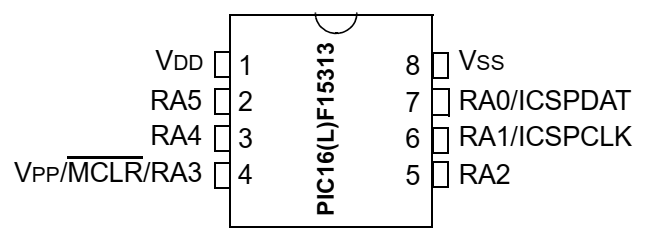
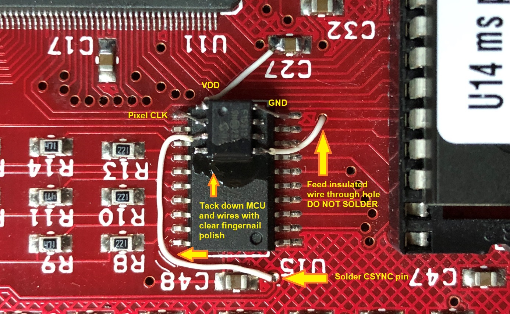
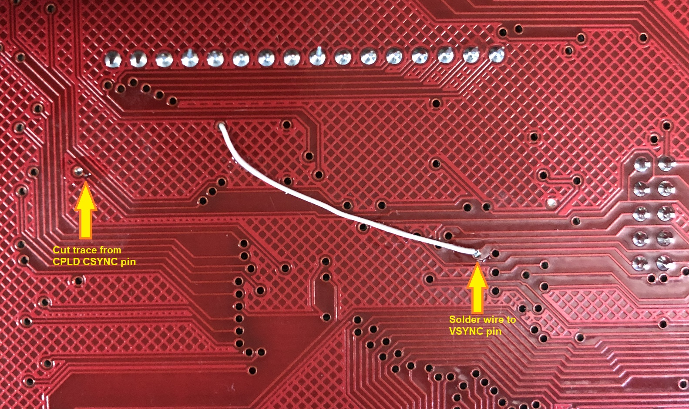
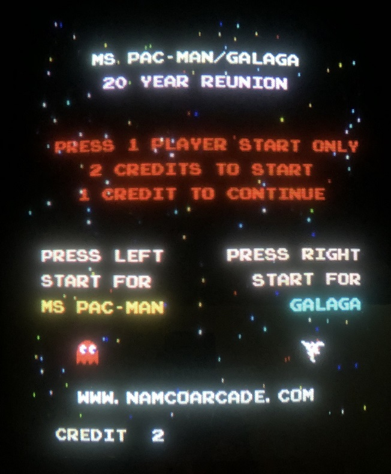
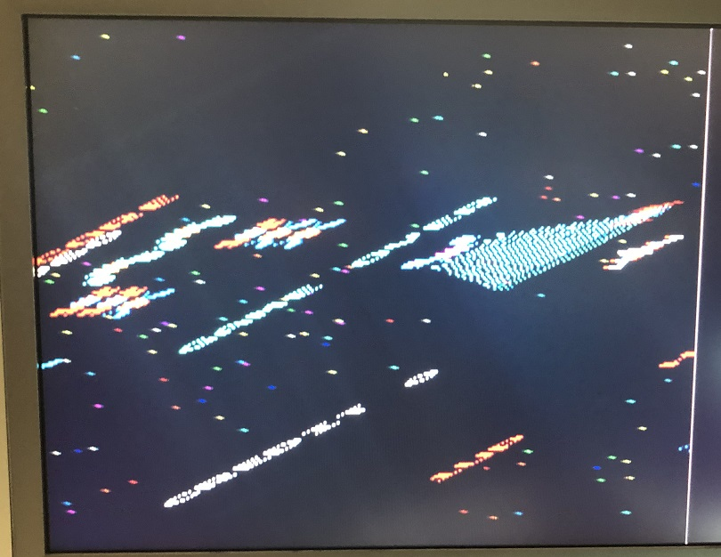

## Composite sync generator for Namco Ms. Pac Man / Galaga 20 Year Reunion PCB

Video output pins on these boards seem to take abuse, commonly having blown video drivers and output resistors.  
Composite sync is generated in the CPLD at U11 and outputs directly to the JAMMA sync pin (no resistor or extra buffer).  
A blown sync output pin makes the game unusable, U11 has no dump, and the part is obsolete.  
This project uses an 8-pin PIC16F15313 (SOIC package) to recreate the composite sync from the 6.144 MHz pixel clock and 60 Hz VSYNC pin available on the board.

MCU pinout:  

MCU Connections:  
RA5: 6.144 MHz pixel clock input  
RA2: ~60 Hz vertical sync input  
RA4: Generated composite sync output  

Install process:  
Start by programming the MCU with included HEX file

Place MCU on top of U15, with pin 1 of the MCU at the bottom of U15  
Using uninsulated 30 AWG wires, connect MCU pin 8 to U15 pin 10 (GND), and MCU pin 2 to U15 pin 11 (Pixel CLK).  
Using insulated 30 AWG wires, connect MCU pin 1 to the + side of C27 (VDD), MCU pin 3 to the via shown near the U15 text, and feed a wire from the MCU pin 5 through a via to the bottom side of the board as shown (DO NOT SOLDER THIS WIRE TO THE VIA).

On the bottom of the board, solder the wire that you fed through the board to the via shown for VSYNC.  
Cut the trace shown to disconnect the new CSYNC output from the dead CPLD output.

If modifications were performed correctly, once powered up, you should see the correct video again!

As compiled using the free version of the compiler with no optimization, this uses 15 of 256 bytes of RAM (6%), and 211 of 2048 words of flash (10%).  
The precompiled .hex file is also included.

Blooper:  
The first time I tested the code, the divider was off by one, skewing the video and resembling the isometric view of Zaxxon.

